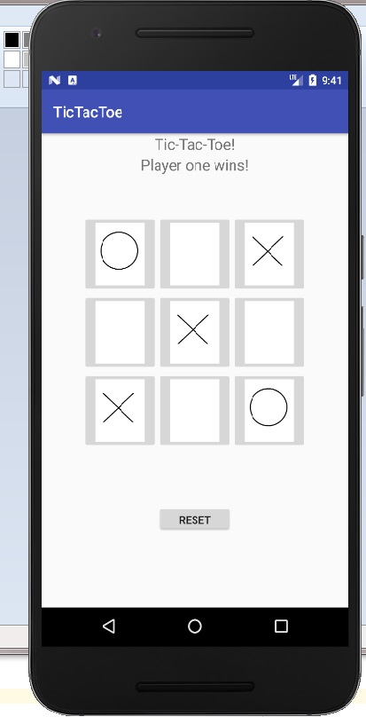

# TicTacToe

## Practice2.zip contains the the 4th 5th and 6th assignment on java.

## The doc folder contains an image of the app

## Other files are for the tic tac toe app
The classic tic-tac-toe game. By pressing the squares, they will be chosen for the corresponding player. A player wins if their row of 3 is achieved. Press the 'reset' button to start a new game! State preservation is not fully functional.

Created by Steven Schoenmaker(10777679)
